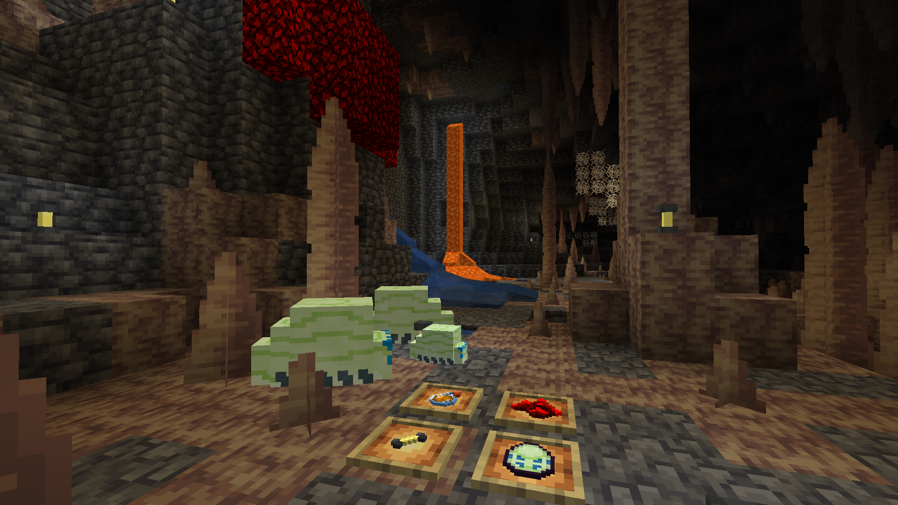

# DigBlockGalactic

Minecraft (1.21.5) mod based on the game Deep Rock Galactic by Ghost Ship Games.

## Progress

Mod is unfinished (because Minecraft modding sucks).

Feel free to take the stuff, just give the appropriate credit (look for `attributions.yaml` and `LICENSE`).

## Features

### Nitra

- Versitile resource used both as fuel and fertilizer.
- Can also be used to craft gunpowder.
- Ore spawns in deep underground, has special spawning rules (blocks are attached to surfaces, similar to original game).

### Fire potion

- Made from Nitra.
- Sets entities on fire.

### Flare

- Made from glowstone / glow ink sac.
- Can be thrown to make a light source.

### Loot Bug

- Drops Nitra and Gold when killed.
- Can be bred with Nitra and Gold.
- Cute.
- Cannot be encountered in wild yet (because Minecraft modding sucks).

### Web in Caves

- Spawns on roofs, similar to original game.
